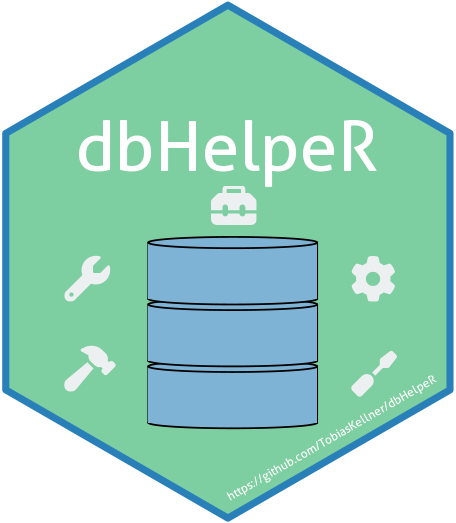

# dbHelpeR  


An R package for working with relational databases

`dbHelpeR` is an R package designed to simplify and streamline interactions with SQL databases. It provides high-level functions for managing database metadata, schemas, constraints, and other common administrative tasks. Whether you’re a data scientist, database administrator, or analyst, `dbHelpeR` bridges the gap between R and SQL, empowering you to manage and interact with databases effortlessly.


## Features

- **Table comments**: query, create and drop table comments
- **Column comments**: query, create and drop column comments
- **Primary keys**: query, create and drop primary keys
- **Foreign keys**:  query, create and drop foreign keys
- **Schemas**: query, create and drop schemas
- **User information**: retrieve user specific information e.g. user name or user privileges
- **Database information**: retrieve database specific information e.g. database name or database type

## Supported Database Types

- PostgreSQL
- Microsoft SQL Server


## Installation

Install `dbHelpeR`

```r
# Install devtools if not already installed
install.packages("devtools")

# Install dbHelpeR from GitHub
devtools::install_github("TobiasKellner/dbHelpeR")
```

## Usage

```r
library(dbHelpeR)
library(DBI)

# Connect to your database
```

## 📄 License

`dbHelpeR` is released under the MIT License, ensuring that it remains free and open for everyone to use. See the [LICENSE](LICENSE) file for more details.
